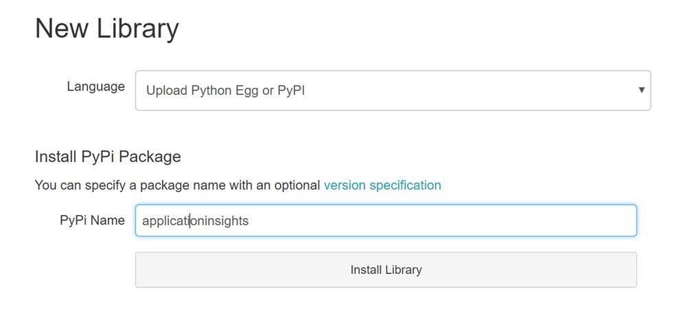
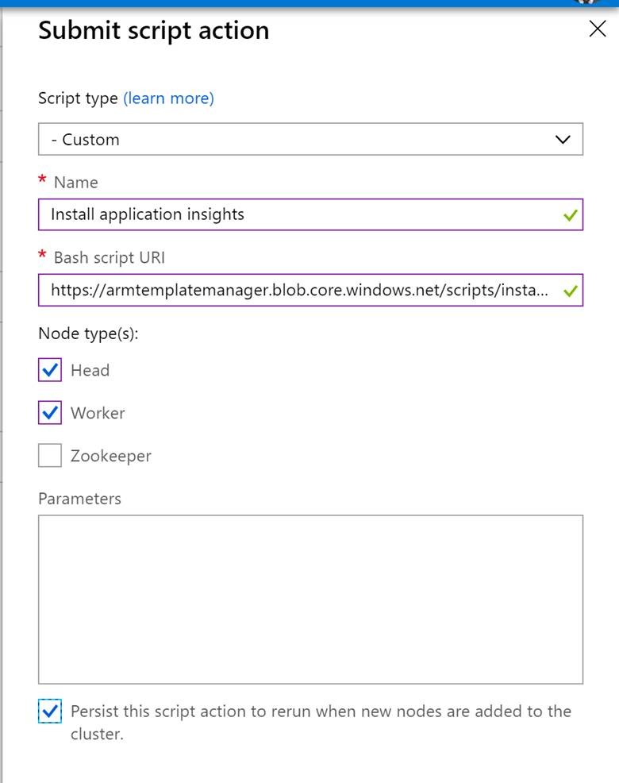
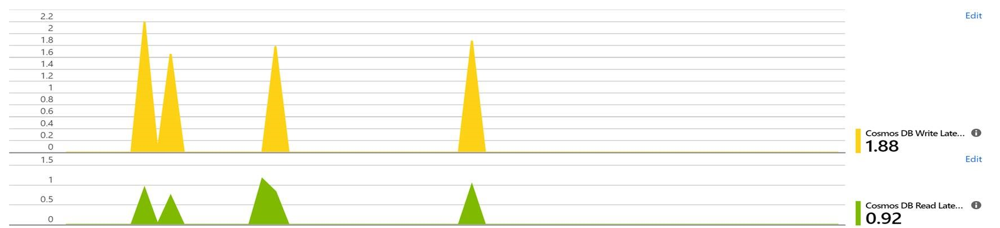
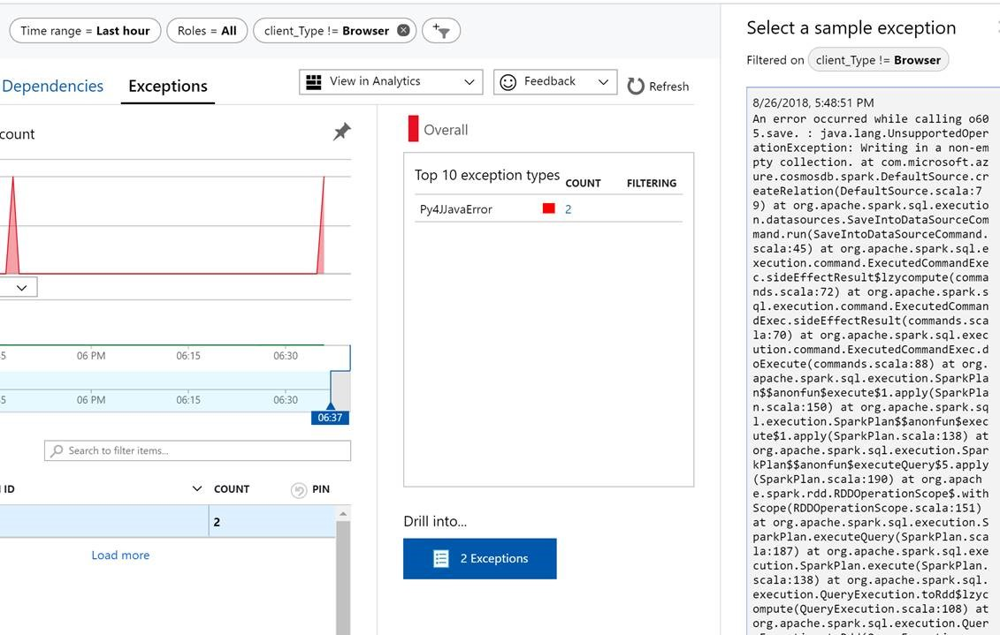
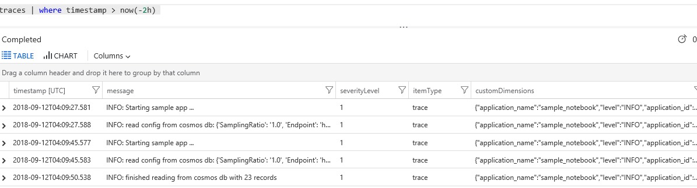
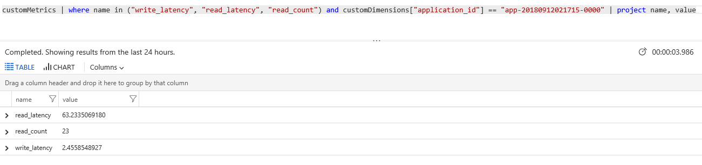
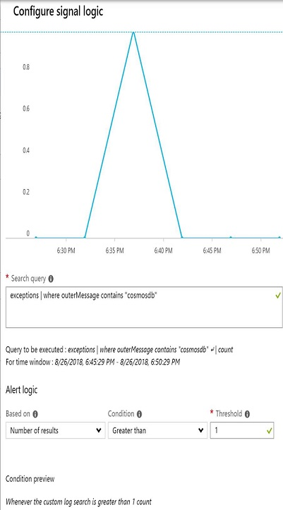

# Azure application insights monitoring and telemetry with cosmos db spark connector
This sample shows how to use azure application insights add monitoring and telemetry to your spark applications that use Cosmos DB Spark connector.
The tutorial is written as a python sample but you can achieve the same in scala with application insights java sdk

## Prerequisites
�	Databricks or HDInsight cluster with with Cosmos DB Spark Connector loaded
�	Application Insights workspace (Note down the instrumentation key from the Dashboard)

## Setup 
### Databricks
1.	Create a new instance of the application insights library in the Databricks workspace
2.	Install the application insights python package by choosing the Language and entering the PyPi name as shown below: 


### HDInsight 
1.	Create a shell script with the below content to install the applicationinsights python package. Save the file as InstallAppInsights.sh
/usr/bin/anaconda/envs/py35/bin/pip install applicationinsights 
2.	Upload this script to a storage account in a container which is publicly accessible
(Example script URI: <TODO> https://armtemplatemanager.blob.core.windows.net/scripts/installappinsights.sh)
3.	Go to the Script Actions pane in the Azure portal for the HDInsight cluster. Run the above script in the Head Nodes and Worker Nodes as shown below : 



## Python spark job 
A full sample is available [here](./test_cosmosdb_appInsights.py)

1.	Once the Databricks/HDInsight cluster is setup with the application insights module, create Python notebook (For HDInsight, make sure to choose PySpark 3).
2.	Import the following libraries:


```
import datetime
from applicationinsights import TelemetryClient, channel
import logging
from applicationinsights.logging import enable, LoggingHandler
import time
from applicationinsights.exceptions import enable
```

3.	Hook up the notebook to the application insights instance using the instrumentation key. Add other relevant metadata for the telemetry context to differentiate between different applications:

```
instrumentation_key = '<Application insights Instrumentation key>'

telemetry_channel = channel.TelemetryChannel()
telemetry_channel.context.device.id = 'Sample notebook'
telemetry_channel.context.application.id = sc.applicationId
telemetry_channel.context.application.ver = '1.0.0'
telemetry_channel.context.properties['application_name'] = 'sample_notebook'
telemetry_channel.context.properties['application_id'] = sc.applicationId

#setup other needed variables
tc = TelemetryClient(instrumentation_key, telemetry_channel)

#Enable unhandled exception logging
enable(instrumentation_key, telemetry_channel)

handler = LoggingHandler(instrumentation_key, telemetry_channel=telemetry_channel)
handler.setLevel(logging.DEBUG)
handler.setFormatter(logging.Formatter('%(levelname)s: %(message)s'))
logger = logging.getLogger('simple_logger')
logger.setLevel(logging.INFO)
logger.addHandler(handler)
```

4.	Using the telemetry client, add relevant log messages and metrics. Track exceptions/failures separately 

�	tc.track_event('Reading from Cosmos DB collection')
�	tc.track_metric('read_latency', readend-readstart)
�	except Exception, e:
      tc.track_exception()

5.	Make sure you flush the telemetry client and shutdown logging at the end of the script:
�	tc.flush()
�	logging.shutdown()

## Application insights logging and metrics

### Basic metrics 
1.	Go to the metrics pane to see the logged metrics 


2.	Failures/Exceptions should show up on the failures tab


### logging and advanced metrics 
Go to the analytics pane to get the detailed logs using application insights queries


#### Example for queries that can be used for viewing logs 
1. Get the logs for the last two hours 

```
traces | where timestamp > now(-2h)  
```


2. Get the logs for a specific spark application id ordered by the time

```
traces | where customDimensions["application_id"] == "app-20180912021715-0000" | order by timestamp asc 
```


3. Get exceptions that were thrown by Cosmos DB 

```
exceptions | where outerMessage contains "cosmosdb" | project timestamp, outerMessage 
```


4. Get different metrics for an application id

```
customMetrics | where name in ("write_latency", "read_latency", "read_count") and customDimensions["application_id"] == "app-20180912021715-0000" | project name, value
```


5. Create a time chart for write_latency for all runs for a certain application name ( similar for read latency and count)

```
customMetrics | where name == "write_latency" and customDimensions["application_name"] == "sample_notebook" | project  timestamp, value | render timechart 
```


### Alerts
4.	Create alerts based on failures when the exception contains cosmosdb in the stack trace. 
Use log search query to filter logs while sending alerts (example: exceptions | where outerMessage contains "cosmosdb") 
 

